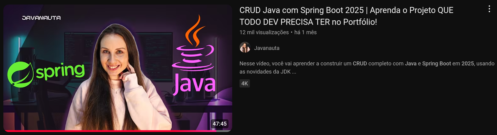
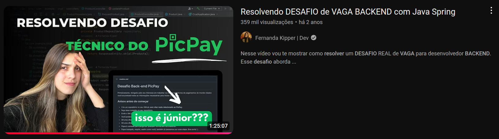

Este repositório contém uma coleção de projetos desenvolvidos, estudados e acompanhados através de videoaulas do YouTube. Cada pasta representa um projeto individual, com seu próprio `README.md` detalhado. Abaixo, um resumo dos projetos contidos neste repositório.

---

### **1. CRUD Java com Spring Boot 2025**

Este projeto é uma API REST para gerenciamento de usuários, desenvolvida com base em uma videoaula do YouTube. Ele implementa operações CRUD (Criar, Ler, Atualizar e Deletar) para a entidade `Usuario` (nome, e-mail, idade).

* **Videoaula de Referência:** [https://www.youtube.com/watch?v=yW7RrWfUeHE](https://www.youtube.com/watch?v=yW7RrWfUeHE)
* **Endpoints Principais:**
    * `POST /usuario`: Salva um novo usuário.
    * `GET /usuario?email={email}`: Busca um usuário por e-mail.
    * `DELETE /usuario?email={email}`: Deleta um usuário por e-mail.
    * `PUT /usuario?id={id}`: Atualiza um usuário por ID.
    * `GET /usuario/todos`: Lista todos os usuários.

---

### **2. Desafio Técnico para Desenvolvedor Java Jr - Posto de Combustíveis**

Esta API foi desenvolvida para gerenciar um sistema de posto de combustível. Ela lida com três entidades principais: `TipoCombustivel`, `BombaCombustivel` e `Abastecimento`.

* **Videoaula de Referência:** [https://www.youtube.com/watch?v=wu29IO2vmfI](https://www.youtube.com/watch?v=wu29IO2vmfI)
* **Endpoints Principais:**
    * **Tipos de Combustível (`/tiposDeCombustivel`):**
        * `POST`: Cria um novo tipo de combustível.
        * `GET`: Lista todos os tipos de combustível ou busca um por ID.
        * `PUT`: Atualiza um tipo de combustível por ID.
        * `DELETE`: Deleta um tipo de combustível por ID.
    * **Bombas de Combustível (`/bombasDeCombustivel`):**
        * `POST`: Cria uma nova bomba.
        * `GET`: Lista todas as bombas ou busca uma por ID.
        * `PUT`: Atualiza uma bomba por ID.
        * `DELETE`: Deleta uma bomba por ID.
    * **Abastecimentos (`/abastecimento`):**
        * `POST`: Registra um novo abastecimento.
        * `GET`: Lista todos os abastecimentos registrados.

---

### **3. PicPay Simplificado API**

Este projeto é uma API de backend em Java com Spring Boot que simula um sistema de transações financeiras. Ele permite o cadastro de usuários e a transferência de valores entre eles, aplicando regras de negócio como a validação de saldo e o tipo de usuário para cada transação.

* **Videoaula de Referência:** [https://www.youtube.com/watch?v=QXunBiLq2SM](https://www.youtube.com/watch?v=QXunBiLq2SM)
* **Endpoints Principais:**
* `POST /users`: Cria um novo usuário.
* `GET /users`: Lista todos os usuários cadastrados.
* `POST /transactions`: Realiza uma transação entre usuários.